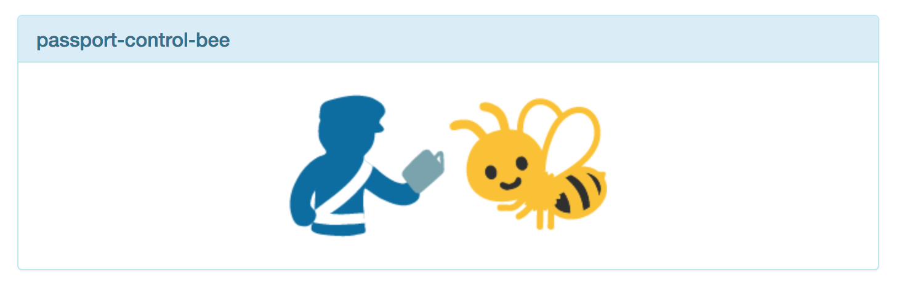

# emoji-name-generator

Every time you refresh the page, you get a hyphenated, lower-case join of two emoji, and a pictorial representation of it. Generates 5 per refresh.

Live at https://jameshill.io/emoji-name-generator

e.g. `passport-control-bee`

Extremely old, but mildly amusing, and deserves to be preserved.

Trawling repos on an old hard drive, found this had never been pushed to github. Committed 2021, but would have been made ~2013
